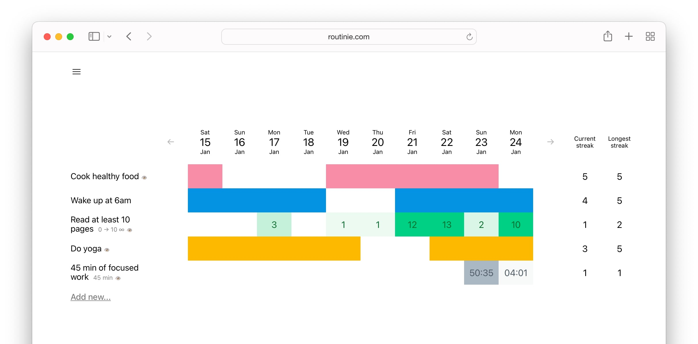

# Routinie: a simple solution to help you stay efficient and productive

Routinie is a simple yet efficient habit tracker that allows you to make sure you progress towards your goals. 
It includes trackers and timers, streaks and public pages, and is packed with features that allow you to efficiently work on improving yourself.

This repository contains the backend for Routinie. There is also [the frontend counterpart](http://github.com/alwx/routinie-frontend).
Routinie [was originally launched](https://www.producthunt.com/products/routinie) as a commercial product. However, it was not successful and I decided to publish its sources.

## Why the sources can be interesting?

1. It's a nice example of a full-featured web app that contains several API methods, logging and instumenting, e-mail sender, session manager, and Stripe integration.
1. It can also be interesting for those who want to see how to deploy an app like that (even though the deployment process is relatively simple and straightforward in this particular case).
1. The streak detection mechanism and the SQL queries to detect streaks can be interesting for everybody doing something like that in their apps (see `pkg/db/trackers.go`)

## Development

1. Install Docker: https://docs.docker.com/docker-for-mac/install/ 
1. Install [go](https://github.com/golang/go)
1. `make development-deps-up &` to run Postgres, Redis, etc
1. `make run` to run the application in development mode

The dev configuration can be found in `configs/development.yml`

## Production

All the scripts to build and deploy the application to production are in `deployments` directory.

The production configuration can be found in `configs/production.yml`.

## License

[MIT License](./LICENSE.txt)